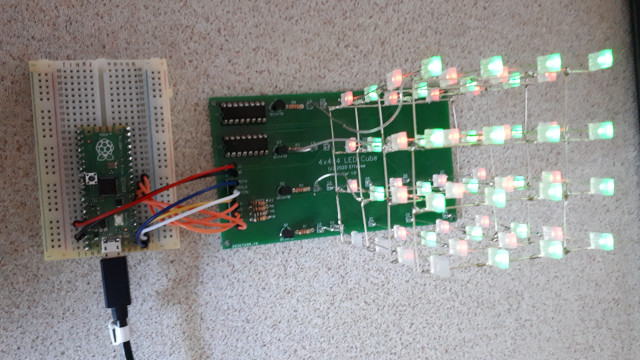

# 4x4x4 LED Cube

A 4x4x4 LED cube with 74HC595N shift registers to set individual LEDs on the different columns. A total of 7 GPIO pins are needed : 3 for the serial communication with the shift registers and 4 for the switching of the layers. The layers are switched on with BC547B NPN transistors to avoid overloading the GPIO's of the µcontroller. The board should be powered with an external 5V power source.

This repository contains :
1. Schematic and PCB design files
2. MicroPython module and example code to drive the cube